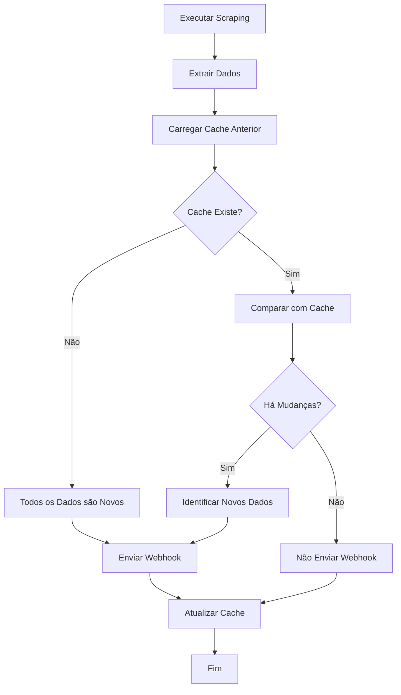

# 🗂️ Sistema de Cache - Apenas Dados Novos

## ✅ Problema Resolvido

O sistema agora envia **apenas dados novos** para o webhook, eliminando duplicação na planilha.

### 🔴 **Problema Anterior:**
```json
{
  "data": [
    { "name": "Completed Rides", "rows": [["Corrida 1"], ["Corrida 2"]] }
  ]
}
```

### 🟢 **Solução Atual:**
```json
{
  "onlyNewData": true,
  "differences": [
    {
      "tableName": "Completed Rides",
      "newRecords": [["Corrida 2"]], // Apenas a nova corrida
      "totalNewRecords": 1
    }
  ],
  "summary": {
    "totalNewRecords": 1,
    "tablesWithChanges": 1
  }
}
```

## 🚀 Como Funciona

### 1. **Sistema de Cache Inteligente**
- **Armazena** dados da execução anterior
- **Compara** dados atuais com dados anteriores
- **Identifica** apenas registros novos
- **Envia** somente mudanças para o webhook

### 2. **Detecção de Mudanças**
- **Hash MD5** para comparação rápida
- **Comparação linha por linha** quando há mudanças
- **Identificação precisa** de novos registros

### 3. **Webhook Otimizado**
- **Primeira execução**: Todos os dados são novos
- **Execuções subsequentes**: Apenas dados novos
- **Sem mudanças**: Webhook não é enviado

## 📊 Estrutura do Payload

### Webhook Anterior (Problema)
```json
{
  "timestamp": "2025-01-08T10:00:00Z",
  "data": [
    {
      "name": "Completed Rides",
      "rows": [
        ["Corrida 1", "Concluída", "08:00"],
        ["Corrida 2", "Concluída", "09:00"]
      ]
    }
  ]
}
```

### Webhook Atual (Solução)
```json
{
  "timestamp": "2025-01-08T10:00:00Z",
  "onlyNewData": true,
  "differences": [
    {
      "tableName": "Completed Rides",
      "newRecords": [
        ["Corrida 2", "Concluída", "09:00"]
      ],
      "updatedRecords": [],
      "removedRecords": [],
      "totalNewRecords": 1
    }
  ],
  "summary": {
    "totalNewRecords": 1,
    "totalUpdatedRecords": 0,
    "totalRemovedRecords": 0,
    "tablesWithChanges": 1
  }
}
```

## 🎯 Benefícios

### 1. **Eliminação de Duplicação**
- ✅ Planilha recebe apenas dados novos
- ✅ Não há duplicação de registros
- ✅ Performance melhorada

### 2. **Webhook Inteligente**
- ✅ Não envia quando não há mudanças
- ✅ Payload menor e mais eficiente
- ✅ Identificação clara de novos dados

### 3. **Controle Preciso**
- ✅ Sabe exatamente quantos registros novos
- ✅ Histórico de mudanças
- ✅ Cache persistente

## 🔧 Endpoints Disponíveis

### 1. **Scraping Principal**
```bash
POST /api/rides/scrape
```
**Resposta:**
```json
{
  "success": true,
  "hasChanges": true,
  "onlyNewData": true,
  "differences": [...],
  "summary": {
    "newRecords": 5,
    "totalRecords": 150
  }
}
```

### 2. **Estatísticas do Cache**
```bash
GET /api/cache/stats
```
**Resposta:**
```json
{
  "cache": {
    "hasCache": true,
    "lastUpdate": "2025-01-08T10:00:00Z",
    "totalTables": 5,
    "totalRecords": 145
  }
}
```

### 3. **Limpar Cache**
```bash
POST /api/cache/clear
```
**Uso:** Força próxima execução a tratar todos os dados como novos.

### 4. **Simular Webhook**
```bash
POST /api/rides/simulate-webhook
```
**Resposta:** Mostra exatamente o que seria enviado para n8n.

## 🧪 Testes

### Teste Completo do Sistema
```bash
npx ts-node test-cache-system.ts
```

**Fluxo de Teste:**
1. ✅ Primeira execução - todos os dados novos
2. ✅ Segunda execução - nenhuma mudança
3. ✅ Limpeza do cache
4. ✅ Terceira execução - todos os dados novos novamente

### Exemplo de Saída
```
1️⃣ Verificando estado inicial do cache...
Estado inicial: { hasCache: false, totalRecords: 0 }

2️⃣ Primeira execução - todos os dados devem ser novos...
✅ Primeira execução concluída
Has changes: true
Total records: 45
Diferenças encontradas:
  - Ongoing Rides: 5 novos registros
  - Completed Rides: 40 novos registros

3️⃣ Segunda execução - não deve ter mudanças...
✅ Segunda execução concluída
Has changes: false
✅ Nenhuma mudança detectada (esperado)
```

## 🔄 Fluxo de Funcionamento



## 📁 Arquivos do Sistema

### `src/services/dataCacheManager.ts`
- Gerencia cache de dados
- Compara dados atuais com anteriores
- Identifica mudanças

### `data/previous-rides-data.json`
- Armazena dados da execução anterior
- Usado para comparação
- Atualizado automaticamente

### `test-cache-system.ts`
- Script de teste completo
- Demonstra funcionamento

## 🎯 Cenários de Uso

### 1. **Primeira Execução**
```json
{
  "hasChanges": true,
  "differences": [
    {
      "tableName": "Completed Rides",
      "newRecords": [["Corrida 1"], ["Corrida 2"]],
      "totalNewRecords": 2
    }
  ]
}
```

### 2. **Nova Corrida Completada**
```json
{
  "hasChanges": true,
  "differences": [
    {
      "tableName": "Completed Rides",
      "newRecords": [["Corrida 3"]],
      "totalNewRecords": 1
    }
  ]
}
```

### 3. **Nenhuma Mudança**
```json
{
  "hasChanges": false,
  "differences": []
}
```
**Resultado:** Webhook não é enviado.

## 🛠️ Configuração no N8N

O webhook agora recebe dados estruturados:

```javascript
// No n8n, processar apenas dados novos
const webhookData = $json.body;

if (webhookData.onlyNewData && webhookData.differences) {
  webhookData.differences.forEach(table => {
    table.newRecords.forEach(row => {
      // Processar apenas registros novos
      // Não há duplicação!
    });
  });
}
```

## 🎉 Resultado Final

### ✅ **Antes (Problema):**
- Webhook enviava todos os dados
- Planilha recebia duplicações
- Performance ruim

### ✅ **Agora (Solução):**
- Webhook envia apenas dados novos
- Planilha recebe apenas registros únicos
- Performance otimizada
- Controle preciso de mudanças

**O sistema agora é 100% otimizado para evitar duplicações!**
