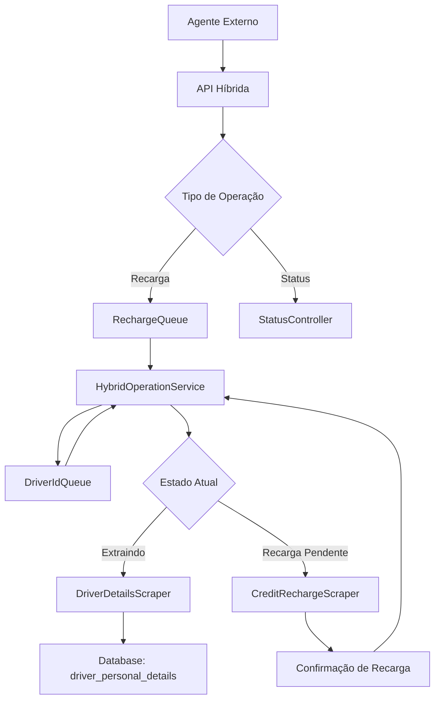

# 🔋 PLANO DE IMPLEMENTAÇÃO - SISTEMA HÍBRIDO DE EXTRAÇÃO E RECARGA

## 📋 **VISÃO GERAL DO PROJETO**

**Objetivo:** Implementar um sistema híbrido que combina extração contínua de dados detalhados dos motoristas com capacidade de recarga de créditos sob demanda.

**Arquitetura:** Sistema híbrido inteligente com um browser operando em modo dual - extração contínua por ID + interrupção para recargas.

---

## 🎯 **ESTRATÉGIA TÉCNICA REVOLUCIONÁRIA**

### **Browser 1: Monitoramento (Existente - Inalterado)**
- ✅ Scraping contínuo de rides e drivers (tabelas gerais)
- ✅ Operação autônoma a cada 10 minutos
- ✅ Sistema de cache e comparação
- ✅ Webhook para n8n

### **Browser 2: Sistema Híbrido Inteligente (Novo)**
- 🔄 **Modo Principal:** Extração contínua de dados pessoais por ID
- 🔄 **Modo Interrupção:** Recarga de créditos sob demanda via API
- 🔄 **Navegação Inteligente:** Sempre produtivo, nunca ocioso
- 🔄 **Sistema de Prioridade:** Pausa extração → Executa recarga → Retoma extração

### **🧠 INTELIGÊNCIA DO SISTEMA**
- 🎯 **Aproveitamento 100%:** Browser sempre coletando dados valiosos
- ⚡ **Interrupção Inteligente:** Pausa, salva estado, executa recarga, retoma
- 🔄 **Recuperação Automática:** Volta exatamente onde parou
- 📊 **Dados Enriquecidos:** Perfil completo de cada motorista

---

## 📊 **CRONOGRAMA DE IMPLEMENTAÇÃO ATUALIZADO**

### **🔥 FASE 1: INFRAESTRUTURA HÍBRIDA** (Estimativa: 3-4 horas)

#### **1.1 Reestruturação do BrowserSessionManager**

- [ ] Modificar para suportar múltiplas instâncias nomeadas
- [ ] Implementar sistema de isolamento entre sessões
- [ ] Adicionar métodos para gerenciar sessões independentes
- [ ] Testar criação simultânea de browsers

#### **1.2 Sistema de Filas e Estados**

- [ ] Criar DriverIdQueue para IDs a processar
- [ ] Implementar RechargeQueue para recargas pendentes
- [ ] Desenvolver sistema de estados (EXTRACTING/RECHARGING)
- [ ] Criar persistência de estado para recuperação

#### **1.3 Nova Estrutura de Dados**

- [ ] Criar tabela driver_personal_details
- [ ] Definir esquema para dados pessoais detalhados
- [ ] Implementar sistema de versionamento de dados
- [ ] Configurar índices para performance

**✅ Critério de Conclusão:** Sistema de filas operacional e nova tabela criada

---

### **🚀 FASE 2: DESENVOLVIMENTO HÍBRIDO** (Estimativa: 5-6 horas)

#### **2.1 HybridOperationManager**

- [ ] Criar classe principal de gerenciamento híbrido
- [ ] Implementar sistema de estados (EXTRACTING/RECHARGING/PAUSED)
- [ ] Desenvolver lógica de interrupção e retomada
- [ ] Criar sistema de priorização de tarefas
- [ ] Implementar persistência de estado

#### **2.2 DriverDetailsScraper**

- [ ] Desenvolver navegação específica por ID de motorista
- [ ] Implementar extração de dados pessoais detalhados
- [ ] Criar sistema de busca por ID na interface
- [ ] Desenvolver mapeamento de campos específicos
- [ ] Implementar tratamento de motoristas não encontrados

#### **2.3 Sistema de Recargas Integrado**

- [ ] Implementar lógica de pausa da extração
- [ ] Desenvolver processo de recarga de créditos
- [ ] Criar sistema de confirmação de transação
- [ ] Implementar recuperação após falhas
- [ ] Desenvolver logs detalhados de operações

#### **2.4 API Controller Híbrida**

- [ ] Endpoint POST `/api/recharge-credit`
- [ ] Endpoint GET `/api/hybrid-status`
- [ ] Endpoint GET `/api/extraction-progress`
- [ ] Endpoint POST `/api/add-driver-ids`
- [ ] Sistema de validação e fila de comandos

**✅ Critério de Conclusão:** Sistema híbrido operacional com extração e recarga funcionais

---

### **🔧 FASE 3: INTEGRAÇÃO E OTIMIZAÇÃO** (Estimativa: 4-5 horas)

#### **3.1 Sistema Dual Coordenado**

- [ ] Integrar monitoramento (Browser 1) + híbrido (Browser 2)
- [ ] Implementar orquestração de inicialização sequencial
- [ ] Criar sistema de logs unificados mas identificados
- [ ] Desenvolver dashboard de status dual

#### **3.2 Otimização do Sistema Híbrido**

- [ ] Implementar cache inteligente de dados pessoais
- [ ] Sistema de detecção de IDs já processados
- [ ] Otimização de navegação entre páginas
- [ ] Sistema de retry para falhas temporárias

#### **3.3 Testes de Interrupção e Recuperação**

- [ ] Teste de interrupção durante extração
- [ ] Teste de múltiplas recargas em sequência
- [ ] Teste de recuperação após falhas
- [ ] Teste de persistência de estado
- [ ] Teste de carga simultânea

**✅ Critério de Conclusão:** Sistema dual operando com interrupções controladas

---

### **📦 FASE 4: PRODUÇÃO E DOCUMENTAÇÃO** (Estimativa: 2 horas)

#### **4.1 Scripts de Produção**
- [ ] Script de inicialização dual
- [ ] Scripts de monitoramento
- [ ] Sistema de restart automático
- [ ] Backup de configurações

#### **4.2 Documentação**
- [ ] Documentação da API
- [ ] Manual de operação
- [ ] Guia de troubleshooting
- [ ] Exemplos de uso

**✅ Critério de Conclusão:** Sistema documentado e pronto para produção

---

## 🏗️ **ARQUITETURA TÉCNICA HÍBRIDA DETALHADA**

### **Estrutura de Arquivos Atualizada**

```text
src/
├── services/
│   ├── monitoringService.ts              # ✅ Existente (inalterado)
│   ├── hybridOperationService.ts         # 🆕 Gerenciador híbrido
│   └── browserSessionManager.ts          # 🔄 Multi-instâncias
├── scraper/
│   ├── ridesPersistentScraper.ts         # ✅ Existente (inalterado)
│   ├── driversPersistentScraper.ts       # ✅ Existente (inalterado)
│   ├── driverDetailsScraper.ts           # 🆕 Extração por ID
│   └── creditRechargeScraper.ts          # 🆕 Recargas específicas
├── queue/
│   ├── driverIdQueue.ts                  # 🆕 Fila de IDs
│   ├── rechargeQueue.ts                  # 🆕 Fila de recargas
│   └── operationStateManager.ts          # 🆕 Persistência de estado
├── api/
│   ├── webhookHandler.ts                 # ✅ Existente (inalterado)
│   ├── hybridController.ts               # 🆕 API híbrida
│   └── statusController.ts               # 🆕 Status dual
├── database/
│   ├── driverDetailsTable.ts            # 🆕 Dados pessoais
│   └── operationLogsTable.ts            # 🆕 Logs operacionais
└── types/
    ├── hybridOperation.ts                # 🆕 Tipos híbridos
    └── driverPersonalData.ts             # 🆕 Dados pessoais
```

### **Fluxo de Dados Híbrido**



---

## ⚙️ **ESPECIFICAÇÕES TÉCNICAS ATUALIZADAS**

### **API Endpoints Híbridos**

#### **POST /api/recharge-credit**

```json
{
  "driverId": "string",
  "amount": "number",
  "requestId": "string (opcional)",
  "priority": "normal|urgent"
}
```

#### **GET /api/hybrid-status**

```json
{
  "status": "extracting|recharging|paused|error",
  "currentMode": "data_extraction|credit_recharge",
  "currentDriverId": "string",
  "extractionProgress": {
    "totalIds": "number",
    "processedIds": "number",
    "currentPosition": "number"
  },
  "rechargeQueue": {
    "pending": "number",
    "processing": "boolean"
  },
  "lastActivity": "datetime",
  "sessionActive": "boolean"
}
```

#### **POST /api/add-driver-ids**

```json
{
  "driverIds": ["string", "string", ...],
  "priority": "normal|high"
}
```

#### **GET /api/extraction-progress**

```json
{
  "totalPersonalRecords": "number",
  "extractedToday": "number",
  "averageTimePerRecord": "number",
  "estimatedCompletion": "datetime"
}
```

### **Estrutura da Nova Tabela**

```sql
CREATE TABLE driver_personal_details (
  id SERIAL PRIMARY KEY,
  driver_id VARCHAR(50) UNIQUE NOT NULL,
  full_name VARCHAR(255),
  phone_number VARCHAR(20),
  email VARCHAR(255),
  address TEXT,
  vehicle_details JSONB,
  documents_status JSONB,
  financial_data JSONB,
  profile_completion_percentage INTEGER,
  account_status VARCHAR(50),
  registration_date TIMESTAMP,
  last_activity TIMESTAMP,
  extracted_at TIMESTAMP DEFAULT NOW(),
  updated_at TIMESTAMP DEFAULT NOW(),
  extraction_source VARCHAR(50) DEFAULT 'hybrid_scraper'
);
```

### **Estados do Sistema Híbrido**

```typescript
enum HybridState {
  EXTRACTING_DATA = 'extracting',      // Coletando dados por ID
  RECHARGE_REQUESTED = 'recharge_req', // Recarga solicitada
  PROCESSING_RECHARGE = 'recharging',  // Executando recarga
  RESUMING_EXTRACTION = 'resuming',    // Voltando à extração
  PAUSED = 'paused',                   // Sistema pausado
  ERROR = 'error'                      // Estado de erro
}
```

---

## 🛡️ **BOAS PRÁTICAS E SEGURANÇA**

### **Isolamento de Sessões**
- ✅ Browsers completamente independentes
- ✅ Portas diferentes para cada serviço
- ✅ Logs separados e identificados
- ✅ Configurações de timeout específicas

### **Tratamento de Erros**
- ✅ Retry automático para falhas de rede
- ✅ Notificação para falhas de autenticação
- ✅ Log detalhado de todas as operações
- ✅ Rollback em caso de erro na recarga

### **Monitoramento**
- ✅ Health checks para ambos os serviços
- ✅ Métricas de performance
- ✅ Alertas de sistema
- ✅ Dashboard de status

---

## 🚦 **CRITÉRIOS DE ACEITAÇÃO ATUALIZADOS**

### **Funcionalidades Obrigatórias**

- [ ] Sistema de monitoramento (Browser 1) continua funcionando normalmente
- [ ] Sistema híbrido (Browser 2) extrai dados pessoais continuamente
- [ ] Interrupção para recarga funciona sem perder posição
- [ ] Recuperação automática após recargas
- [ ] API híbrida responde a todos os comandos
- [ ] Logs identificam claramente ambos os sistemas
- [ ] Persistência de estado entre interrupções

### **Performance**

- [ ] Extração de dados pessoais < 30 segundos por motorista
- [ ] Interrupção para recarga < 10 segundos
- [ ] Processo de recarga completo < 30 segundos
- [ ] Recuperação de estado < 5 segundos
- [ ] Sistema processa 100+ motoristas por hora

### **Confiabilidade**

- [ ] Sistema detecta falhas de sessão em ambos browsers
- [ ] Recovery automático de estado após falhas
- [ ] Zero conflitos entre os dois browsers
- [ ] Operação estável por 24h+ sem intervenção
- [ ] Fila de recargas nunca perde dados

---

## 📝 **NOTAS DE IMPLEMENTAÇÃO ATUALIZADAS**

### **Prioridades**

1. **ALTA:** Preservação do sistema de monitoramento existente
2. **ALTA:** Estabilidade da extração de dados pessoais
3. **ALTA:** Confiabilidade das interrupções/recargas
4. **MÉDIA:** Performance da API híbrida
5. **BAIXA:** Interface de administração

### **Riscos Identificados e Mitigações**

- **Perda de posição na extração:** Mitigado com persistência de estado robustra
- **Conflito de sessões:** Mitigado com isolamento total de browsers
- **Falha durante recarga:** Mitigado com sistema de retry e logs detalhados
- **Sobrecarga de recursos:** Monitorado via métricas de sistema

### **Vantagens da Abordagem Híbrida**

- **ROI Máximo:** Browser sempre produtivo coletando dados valiosos
- **Eficiência Operacional:** Zero tempo perdido com navegação aleatória
- **Flexibilidade:** Recargas sob demanda sem comprometer extração
- **Escalabilidade:** Sistema pode processar milhares de IDs
- **Inteligência:** Recuperação automática e gerenciamento de estado

---

## 🎯 **MARCOS DE PROGRESSO ATUALIZADOS**

- [ ] **Marco 1:** BrowserSessionManager multi-instância + Sistema de filas operacional
- [ ] **Marco 2:** HybridOperationService extraindo dados pessoais por ID
- [ ] **Marco 3:** Sistema de interrupção/recarga funcionando
- [ ] **Marco 4:** Persistência de estado e recuperação automática
- [ ] **Marco 5:** API híbrida completa e sistema em produção

---

**Data de Criação:** 21/08/2025  
**Última Atualização:** 21/08/2025  
**Status:** 📋 Plano Híbrido Atualizado - Sistema de Extração + Recarga Pronto para Implementação

---

## 🎯 **RESUMO EXECUTIVO DA NOVA ABORDAGEM**

### **🔥 INOVAÇÃO PRINCIPAL**
**Sistema Híbrido Inteligente:** Um browser que opera em modo dual - extração contínua de dados pessoais por ID + interrupção controlada para recargas sob demanda.

### **⚡ VANTAGENS COMPETITIVAS**
- **Produtividade 100%:** Browser sempre coletando dados valiosos
- **Interrupção Inteligente:** Pausa → Recarga → Retoma exatamente onde parou
- **Dados Enriquecidos:** Perfil completo de cada motorista
- **Operação Eficiente:** Zero tempo perdido com navegação aleatória

### **🚀 PRÓXIMO PASSO**
Iniciar **FASE 1** - Implementação da infraestrutura híbrida com sistema de filas e estados.
